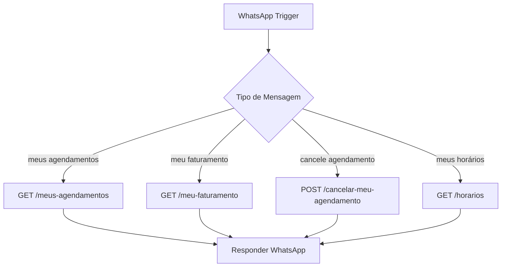

# 📚 DOCUMENTAÇÃO COMPLETA - API VINCI BARBEARIA

**Data:** 11/12/2025
**Versão:** 1.0
**Base URL:** `https://seu-dominio.vercel.app`

---

## 📋 ÍNDICE

1. [APIs de Agendamentos](#1-apis-de-agendamentos)
2. [APIs para Barbeiros (WhatsApp)](#2-apis-para-barbeiros-whatsapp)
3. [APIs para Clientes](#3-apis-para-clientes)
4. [APIs de Serviços](#4-apis-de-serviços)
5. [APIs de Debug](#5-apis-de-debug)
6. [APIs de Cron/Automação](#6-apis-de-cronautomação)
7. [Códigos de Status](#7-códigos-de-status)
8. [Exemplos de Uso](#8-exemplos-de-uso)

---

## 1. APIs de Agendamentos

### 1.1. Criar Agendamento

**Endpoint:** `POST /api/agendamentos/criar`

**Descrição:** Cria um novo agendamento na barbearia.

**Headers:**
```
Content-Type: application/json
```

**Body:**
```json
{
  "data": "11-12-2025",           // DD-MM-YYYY ou YYYY-MM-DD
  "hora": "14:00",
  "servico_id": "uuid-do-servico",
  "barbeiro_id": null,            // null = rodízio automático
  "cliente_nome": "Fabio Silva",
  "cliente_telefone": "11999999999"
}
```

**Resposta Sucesso (200):**
```json
{
  "success": true,
  "message": "Agendamento criado com sucesso!",
  "agendamento": {
    "id": "uuid-agendamento",
    "data_agendamento": "11/12/2025",
    "hora_inicio": "14:00",
    "nome_cliente": "Fabio Silva",
    "telefone": "11999999999",
    "valor": 70.00,
    "status": "agendado",
    "profissional_id": "uuid-barbeiro",
    "servico_id": "uuid-servico"
  }
}
```

**Erros:**
- `400`: Parâmetros inválidos ou faltando
- `404`: Serviço ou barbeiro não encontrado
- `409`: Horário já ocupado
- `500`: Erro interno do servidor

---

### 1.2. Cancelar Agendamento

**Endpoint:** `POST /api/agendamentos/cancelar`

**Descrição:** Cancela um agendamento existente.

**Body:**
```json
{
  "agendamento_id": "uuid-do-agendamento"
}
```

**Resposta Sucesso (200):**
```json
{
  "success": true,
  "message": "Agendamento cancelado com sucesso!"
}
```

---

### 1.3. Confirmar Comparecimento

**Endpoint:** `POST /api/agendamentos/confirmar-comparecimento`

**Descrição:** Marca que o cliente compareceu ao agendamento.

**Body:**
```json
{
  "agendamento_id": "uuid-do-agendamento",
  "compareceu": true
}
```

**Resposta Sucesso (200):**
```json
{
  "success": true,
  "message": "Comparecimento confirmado!",
  "agendamento": {
    "id": "uuid",
    "status": "concluido",
    "compareceu": true,
    "checkin_at": "2025-12-11T14:30:00.000Z"
  }
}
```

---

### 1.4. Horários Disponíveis

**Endpoint:** `GET /api/agendamentos/horarios-disponiveis`

**Descrição:** Lista horários disponíveis para um barbeiro em uma data.

**Query Parameters:**
```
?barbeiro_id=uuid-barbeiro&data=11-12-2025
```

**Resposta Sucesso (200):**
```json
{
  "success": true,
  "horarios_disponiveis": [
    "08:00", "08:30", "09:00", "09:30", "10:00",
    "14:00", "14:30", "15:00"
  ],
  "horarios_ocupados": [
    "10:30", "11:00", "11:30", "13:00", "13:30"
  ]
}
```

---

### 1.5. Buscar Barbeiro Rodízio

**Endpoint:** `GET /api/agendamentos/buscar-barbeiro-rodizio`

**Descrição:** Retorna o próximo barbeiro no sistema de rodízio automático.

**Query Parameters:**
```
?data=11-12-2025
```

**Resposta Sucesso (200):**
```json
{
  "success": true,
  "barbeiro": {
    "id": "uuid-barbeiro",
    "nome": "Hiago",
    "agendamentos_hoje": 3
  },
  "motivo": "Barbeiro com menos agendamentos hoje"
}
```

---

## 2. APIs para Barbeiros (WhatsApp)

### 2.1. Agendamentos (NOVA - Recomendada) ⭐

**Endpoint:** `GET /api/barbeiro/agendamentos`

**Descrição:** API intuitiva para barbeiros consultarem agendamentos com linguagem natural. **RECOMENDADA PARA IA/CHATBOTS**.

**Headers:**
```
Authorization: Bearer SEU_TOKEN_AQUI
```

**Query Parameters:**
```
?barbeiro=Hiago&quando=terca
```

**Parâmetros:**
- `barbeiro` (obrigatório): Nome do barbeiro OU UUID do barbeiro
- `quando` (opcional): Filtro de data com linguagem natural
  - **Dias relativos:** `hoje`, `amanha`
  - **Dias da semana:** `segunda`, `terca`, `quarta`, `quinta`, `sexta`, `sabado`, `domingo`
  - **Data específica:** `21/12/2024` ou `2024-12-21`
  - **Sem filtro:** retorna todos os agendamentos futuros

**Resposta Sucesso (200):**
```json
{
  "success": true,
  "data": {
    "barbeiro": {
      "id": "uuid-barbeiro",
      "nome": "Hiago"
    },
    "filtro": "terca",
    "descricao": "terça-feira (24/12/2024)",
    "data_filtro": "24/12/2024",
    "total_agendamentos": 5,
    "valor_total": 250.00,
    "agendamentos": [
      {
        "id": "uuid",
        "data": "24/12/2024",
        "hora": "09:00",
        "cliente": "João Silva",
        "telefone": "11999999999",
        "servicos": "Corte + Barba",
        "valor": 50.00,
        "status": "confirmado",
        "observacoes": null
      }
    ],
    "mensagem_whatsapp": "📅 *Agendamentos - terça-feira (24/12/2024)*\n\n👤 *Barbeiro:* Hiago\n📊 *Total:* 5 agendamento(s)\n💰 *Valor total:* R$ 250.00\n\n─────────────────\n\n*1. 09:00* - João Silva\n   📞 11999999999\n   ✂️ Corte + Barba\n   💵 R$ 50.00"
  }
}
```

**Exemplos de Uso:**
```bash
# Agendamentos de hoje
GET /api/barbeiro/agendamentos?barbeiro=Hiago&quando=hoje

# Agendamentos de amanhã
GET /api/barbeiro/agendamentos?barbeiro=Hiago&quando=amanha

# Próxima terça-feira
GET /api/barbeiro/agendamentos?barbeiro=Hiago&quando=terca

# Data específica
GET /api/barbeiro/agendamentos?barbeiro=Hiago&quando=25/12/2024

# Todos os futuros
GET /api/barbeiro/agendamentos?barbeiro=Hiago
```

**Perguntas que a IA pode responder:**
| Pergunta do Barbeiro | Parâmetro `quando` |
|---------------------|-------------------|
| "Quais meus agendamentos hoje?" | `hoje` |
| "Tenho cliente amanhã?" | `amanha` |
| "Quantos clientes tenho na terça?" | `terca` |
| "Mostra minha agenda de quinta" | `quinta` |
| "Agendamentos do dia 25/12" | `25/12/2024` |
| "Quais meus próximos clientes?" | *(não passar)* |

**Erros:**
- `400`: Parâmetro "barbeiro" faltando ou filtro "quando" inválido
- `401`: Token não fornecido
- `403`: Token inválido
- `404`: Barbeiro não encontrado
- `500`: Erro interno

**Documentação completa:** Ver arquivo `API-BARBEIRO-AGENDAMENTOS.md`

---

### 2.2. Meus Agendamentos (Legacy)

**Endpoint:** `GET /api/barbeiros/meus-agendamentos`

**Descrição:** Lista agendamentos de um barbeiro específico com períodos pré-definidos.

**⚠️ NOTA:** Para IA/Chatbots, use a nova API `/api/barbeiro/agendamentos` (seção 2.1)

**Query Parameters:**
```
?barbeiro_nome=Hiago&periodo=hoje
```

**Parâmetros:**
- `barbeiro_nome` (obrigatório): Nome do barbeiro
- `periodo` (opcional): `hoje`, `amanha`, `semana`, `semana_que_vem`, `mes`, `mes_que_vem`, `proximos7dias`, `proximos30dias` (padrão: `hoje`)

**Resposta Sucesso (200):**
```json
{
  "success": true,
  "barbeiro": "Hiago",
  "periodo": "hoje",
  "total_agendamentos": 3,
  "agendamentos": [
    {
      "id": "uuid",
      "data": "11/12/2025",
      "hora": "09:00",
      "cliente": "João Silva",
      "telefone": "11999999999",
      "servico": "Corte Masculino",
      "valor": 70.00,
      "status": "confirmado"
    }
  ],
  "mensagem_whatsapp": "📅 *Seus agendamentos hoje*\n\n✅ 09:00 - João Silva\n   Serviço: Corte Masculino\n   Valor: R$ 70,00\n   Status: Confirmado\n\n📊 *Resumo:* 3 agendamentos hoje"
}
```

**Exemplo de uso no N8N/WhatsApp:**
```
GET https://seu-dominio.vercel.app/api/barbeiros/meus-agendamentos?barbeiro_nome=Hiago&periodo=hoje
```

---

### 2.3. Meu Faturamento

**Endpoint:** `GET /api/barbeiros/meu-faturamento`

**Descrição:** Retorna o faturamento de um barbeiro.

**Query Parameters:**
```
?barbeiro_nome=Hiago&periodo=hoje
```

**Parâmetros:**
- `barbeiro_nome` (obrigatório): Nome do barbeiro
- `periodo` (opcional): `hoje`, `semana`, `mes` (padrão: `hoje`)

**Resposta Sucesso (200):**
```json
{
  "success": true,
  "barbeiro": "Hiago",
  "periodo": "hoje",
  "faturamento": {
    "total": 280.00,
    "total_agendamentos": 4,
    "agendamentos_concluidos": 3,
    "ticket_medio": 93.33,
    "detalhes": [
      {
        "data": "11/12/2025",
        "hora": "09:00",
        "cliente": "João Silva",
        "servico": "Corte Masculino",
        "valor": 70.00,
        "status": "concluido"
      }
    ]
  },
  "mensagem_whatsapp": "💰 *Seu faturamento hoje*\n\n💵 Total: R$ 280,00\n📊 Atendimentos: 3 concluídos\n📈 Ticket médio: R$ 93,33\n\n✅ 09:00 - João - R$ 70,00"
}
```

**Nota:** Só conta agendamentos com `status='concluido'`.

---

### 2.4. Cancelar Meu Agendamento

**Endpoint:** `POST /api/barbeiros/cancelar-meu-agendamento`

**Descrição:** Permite barbeiro cancelar agendamento via WhatsApp.

**Body:**
```json
{
  "barbeiro_nome": "Hiago",
  "cliente_nome": "Fabio",
  "hora": "13:00",
  "data": "11/12/2025"           // Opcional, padrão: hoje
}
```

**Resposta Sucesso (200):**
```json
{
  "success": true,
  "message": "Agendamento cancelado com sucesso!",
  "data": {
    "agendamento_id": "uuid",
    "cliente": "Fabio Silva",
    "data": "11/12/2025",
    "hora": "13:00",
    "valor": 70.00,
    "mensagem_whatsapp": "✅ *Agendamento cancelado com sucesso!*\n\n📅 *Data:* 11/12/2025\n🕐 *Hora:* 13:00\n👤 *Cliente:* Fabio Silva\n📞 *Telefone:* 11999999999\n💵 *Valor:* R$ 70,00\n\nO cliente será notificado sobre o cancelamento."
  }
}
```

**Erros:**
- `400`: Parâmetro faltando (barbeiro_nome, cliente_nome, hora)
- `404`: Barbeiro não encontrado ou agendamento não encontrado
- `500`: Erro ao cancelar

**Exemplo no N8N:**
```javascript
// Quando barbeiro envia: "cancele o agendamento do Fabio as 13:00"
POST https://seu-dominio.vercel.app/api/barbeiros/cancelar-meu-agendamento
{
  "barbeiro_nome": "Hiago",
  "cliente_nome": "Fabio",
  "hora": "13:00"
}
```

---

### 2.5. Horários do Barbeiro

**Endpoint:** `GET /api/barbeiros/horarios`

**Descrição:** Lista todos os horários de todos os barbeiros para hoje.

**Query Parameters:** Nenhum

**Resposta Sucesso (200):**
```json
{
  "success": true,
  "data": "11/12/2025",
  "barbeiros": [
    {
      "nome": "Hiago",
      "horarios": {
        "08:00": { "status": "livre" },
        "09:00": {
          "status": "ocupado",
          "cliente": "João Silva",
          "servico": "Corte Masculino"
        },
        "10:00": { "status": "livre" }
      }
    }
  ],
  "mensagem_whatsapp": "📅 *Horários para hoje - 11/12/2025*\n\n👨‍🦰 *Hiago*\n✅ 08:00 - Livre\n❌ 09:00 - João Silva (Corte)\n✅ 10:00 - Livre"
}
```

---

### 2.6. Agendamentos Hoje (Legacy)

**Endpoint:** `GET /api/barbeiros/agendamentos-hoje`

**Descrição:** Lista agendamentos de hoje de um barbeiro.

**Query Parameters:**
```
?barbeiro_nome=Hiago
```

**Resposta:** Similar a `/meus-agendamentos?periodo=hoje`

---

### 2.7. Agendamentos Semana (Legacy)

**Endpoint:** `GET /api/barbeiros/agendamentos-semana`

**Descrição:** Lista agendamentos da semana de um barbeiro.

**Query Parameters:**
```
?barbeiro_nome=Hiago
```

**Resposta:** Similar a `/meus-agendamentos?periodo=semana`

---

### 2.8. Faturamento Mês (Legacy)

**Endpoint:** `GET /api/barbeiros/faturamento-mes`

**Descrição:** Faturamento do mês de um barbeiro.

**Query Parameters:**
```
?barbeiro_nome=Hiago
```

**Resposta:** Similar a `/meu-faturamento?periodo=mes`

---

### 2.9. Listar Barbeiros

**Endpoint:** `GET /api/barbeiros/listar`

**Descrição:** Lista todos os barbeiros ativos com estatísticas de atendimentos e sistema de rodízio.

**Query Parameters:**
```
?ativo=true    (Opcional) Filtra apenas barbeiros ativos (padrão: true)
```

**Resposta Sucesso (200):**
```json
{
  "total": 3,
  "proximo_rodizio": {
    "id": "uuid-1",
    "nome": "Hiago",
    "atendimentos_hoje": 2
  },
  "barbeiros": [
    {
      "id": "uuid-1",
      "nome": "Hiago",
      "telefone": "11988888888",
      "email": "hiago@vincebarbearia.com",
      "especialidades": ["Corte", "Barba", "Coloração"],
      "ativo": true,
      "estatisticas": {
        "total_atendimentos": 145,
        "atendimentos_hoje": 2,
        "total_concluidos": 132
      }
    },
    {
      "id": "uuid-2",
      "nome": "Carlos",
      "telefone": "11977777777",
      "email": "carlos@vincebarbearia.com",
      "especialidades": ["Corte", "Barba", "Tratamentos"],
      "ativo": true,
      "estatisticas": {
        "total_atendimentos": 98,
        "atendimentos_hoje": 3,
        "total_concluidos": 89
      }
    }
  ],
  "mensagem_para_cliente": "Temos 3 barbeiro(s) disponível(is). Escolha seu preferido ou deixe em branco para rodízio automático."
}
```

**Exemplo de uso no N8N:**
```bash
curl https://seu-dominio.vercel.app/api/barbeiros/listar

# Listar todos (inclusive inativos)
curl https://seu-dominio.vercel.app/api/barbeiros/listar?ativo=false
```

---

## 3. APIs para Clientes

### 3.1. Meus Agendamentos (Cliente)

**Endpoint:** `GET /api/clientes/meus-agendamentos`

**Descrição:** Lista agendamentos de um cliente por telefone.

**Query Parameters:**
```
?telefone=11999999999
```

**Resposta Sucesso (200):**
```json
{
  "success": true,
  "cliente": {
    "nome": "Fabio Silva",
    "telefone": "11999999999"
  },
  "agendamentos": [
    {
      "id": "uuid",
      "data": "11/12/2025",
      "hora": "14:00",
      "barbeiro": "Hiago",
      "servico": "Corte Masculino",
      "valor": 70.00,
      "status": "confirmado"
    }
  ],
  "total": 1
}
```

---

## 4. APIs de Serviços

### 4.1. Listar Serviços

**Endpoint:** `GET /api/servicos`

**Descrição:** Lista todos os serviços disponíveis.

**Resposta Sucesso (200):**
```json
{
  "success": true,
  "servicos": [
    {
      "id": "uuid-1",
      "nome": "Corte Masculino",
      "preco": 70.00,
      "duracao_minutos": 30,
      "ativo": true
    },
    {
      "id": "uuid-2",
      "nome": "Barba Completa",
      "preco": 50.00,
      "duracao_minutos": 20,
      "ativo": true
    }
  ]
}
```

---

## 5. APIs de Debug

### 5.1. Debug Serviços

**Endpoint:** `GET /api/debug/servicos`

**Descrição:** Retorna informações detalhadas dos serviços para debug.

**Resposta Sucesso (200):**
```json
{
  "total_servicos": 5,
  "servicos_ativos": 4,
  "servicos": [...]
}
```

---

## 6. APIs de Cron/Automação

### 6.1. Lembretes Automáticos (SIMPLES - N8N)

**Endpoint:** `GET /api/lembretes`

**Descrição:** API SIMPLES para N8N buscar agendamentos e enviar lembretes. **SEM AUTENTICAÇÃO NECESSÁRIA**.

**Query Parameters:**
```
?tipo=amanha
```

**Parâmetros:**
- `tipo` (obrigatório):
  - `amanha` - Agendamentos de amanhã (lembrete 24h antes)
  - `hoje` - Agendamentos de hoje (lembrete no dia)
  - `1hora` - Agendamentos daqui 1 hora

**Resposta Sucesso (200):**
```json
{
  "success": true,
  "tipo": "amanha",
  "data_busca": "12/12/2025",
  "total": 3,
  "lembretes": [
    {
      "cliente": "João Silva",
      "telefone": "11999999999",
      "data": "12/12/2025",
      "hora": "09:00",
      "barbeiro": "Hiago",
      "servico": "Corte Masculino",
      "valor": "70.00"
    },
    {
      "cliente": "Maria Santos",
      "telefone": "11988888888",
      "data": "12/12/2025",
      "hora": "10:00",
      "barbeiro": "Carlos",
      "servico": "Barba Completa",
      "valor": "50.00"
    }
  ]
}
```

**Exemplo de Uso:**
```bash
# Buscar lembretes de amanhã
curl https://vincibarbearia.vercel.app/api/lembretes?tipo=amanha

# Buscar lembretes de hoje
curl https://vincibarbearia.vercel.app/api/lembretes?tipo=hoje

# Buscar lembretes de 1 hora antes
curl https://vincibarbearia.vercel.app/api/lembretes?tipo=1hora
```

**Configuração N8N Cron:**
```
Schedule: 0 18 * * * (todo dia às 18h para "amanha")
URL: GET https://vincibarbearia.vercel.app/api/lembretes?tipo=amanha
Authentication: None (sem autenticação)
```

---

### 6.2. Lembretes Avançados (Webhook)

**Endpoint:** `GET /api/cron/lembretes`

**Descrição:** Endpoint avançado com webhook automático. Requer autenticação e configuração de webhook.

**⚠️ NOTA:** Use `/api/lembretes` (simples) para N8N. Esta API é para Vercel Cron com webhook.

**Headers:**
```
Authorization: Bearer SEU_TOKEN_SECRETO
```

---

## 7. Códigos de Status

### Status de Agendamentos

| Status | Descrição | Conta como faturamento? |
|--------|-----------|------------------------|
| `agendado` | Agendamento criado | ❌ Não |
| `confirmado` | Cliente confirmou presença | ❌ Não |
| `em_andamento` | Atendimento iniciado | ❌ Não |
| `concluido` | Atendimento concluído | ✅ **SIM** |
| `cancelado` | Agendamento cancelado | ❌ Não |

### Códigos HTTP

| Código | Significado |
|--------|-------------|
| `200` | Sucesso |
| `201` | Criado com sucesso |
| `400` | Requisição inválida |
| `401` | Não autorizado |
| `404` | Não encontrado |
| `409` | Conflito (ex: horário ocupado) |
| `500` | Erro interno do servidor |

---

## 8. Exemplos de Uso

### 8.1. Criar Agendamento via cURL

```bash
curl -X POST https://seu-dominio.vercel.app/api/agendamentos/criar \
  -H "Content-Type: application/json" \
  -d '{
    "data": "11-12-2025",
    "hora": "14:00",
    "servico_id": "uuid-servico",
    "cliente_nome": "Fabio Silva",
    "cliente_telefone": "11999999999"
  }'
```

---

### 8.2. Barbeiro Consultar Agendamentos (N8N)

**Trigger:** Mensagem do barbeiro no WhatsApp
**Condição:** Texto contém "meus agendamentos hoje"

**HTTP Request:**
```
Method: GET
URL: https://seu-dominio.vercel.app/api/barbeiros/meus-agendamentos
Query: barbeiro_nome={{$node["WhatsApp Trigger"].json["nome"]}}&periodo=hoje
```

**Resposta WhatsApp:**
```
{{$json["mensagem_whatsapp"]}}
```

---

### 8.3. Barbeiro Cancelar Agendamento (N8N)

**Trigger:** Mensagem "cancele o agendamento do Fabio as 13:00"

**Regex para extrair dados:**
```javascript
const match = message.match(/cancele.*?(\w+).*?(\d{2}:\d{2})/i);
const cliente = match[1]; // "Fabio"
const hora = match[2];    // "13:00"
```

**HTTP Request:**
```
Method: POST
URL: https://seu-dominio.vercel.app/api/barbeiros/cancelar-meu-agendamento
Body: {
  "barbeiro_nome": "{{$node["WhatsApp Trigger"].json["nome"]}}",
  "cliente_nome": "{{$json["cliente"]}}",
  "hora": "{{$json["hora"]}}"
}
```

---

### 8.4. Consultar Faturamento (N8N)

**Trigger:** Mensagem "quanto ganhei hoje"

**HTTP Request:**
```
Method: GET
URL: https://seu-dominio.vercel.app/api/barbeiros/meu-faturamento
Query: barbeiro_nome={{$node["WhatsApp Trigger"].json["nome"]}}&periodo=hoje
```

**Resposta:**
```
💰 Total: R$ {{$json["faturamento"]["total"]}}
📊 Atendimentos: {{$json["faturamento"]["agendamentos_concluidos"]}}
📈 Ticket médio: R$ {{$json["faturamento"]["ticket_medio"]}}
```

---

### 8.5. Fluxo Completo N8N - Lembretes Automáticos

**WORKFLOW 1: Lembrete de Amanhã (18h)**

```
[Schedule Trigger]      →  [HTTP Request]        →  [Loop]           →  [WhatsApp]
0 18 * * *                 GET /api/lembretes       Para cada item      Envia mensagem
(Todo dia 18h)             ?tipo=amanha             do array lembretes  individual
```

**Passo a passo no N8N:**

1. **Schedule Trigger:**
   - Cron: `0 18 * * *`
   - Timezone: `America/Sao_Paulo`

2. **HTTP Request:**
   - Method: `GET`
   - URL: `https://vincibarbearia.vercel.app/api/lembretes?tipo=amanha`
   - Authentication: `None`

3. **Loop Over Items:**
   - Field: `{{$json.lembretes}}`

4. **WhatsApp - Send Message:**
   - Phone: `{{$item.telefone}}`
   - Message:
   ```
   📅 *Lembrete de Agendamento*

   Olá {{$item.cliente}}!

   Você tem um agendamento AMANHÃ:

   📆 Data: {{$item.data}}
   🕐 Hora: {{$item.hora}}
   💈 Barbeiro: {{$item.barbeiro}}
   ✂️ Serviço: {{$item.servico}}
   💵 Valor: R$ {{$item.valor}}

   📍 Vinci Barbearia

   Se não puder comparecer, por favor,
   avise com antecedência!

   Aguardamos você! 💈
   ```

---

**WORKFLOW 2: Lembrete de Hoje (8h)**

```
[Schedule Trigger]      →  [HTTP Request]        →  [Loop]           →  [WhatsApp]
0 8 * * *                  GET /api/lembretes       Para cada item      Envia mensagem
(Todo dia 8h)              ?tipo=hoje               do array lembretes  individual
```

Mesma configuração, apenas mude:
- Cron: `0 8 * * *`
- URL: `?tipo=hoje`
- Mensagem: "Você tem agendamento **HOJE**"

---

**WORKFLOW 3: Lembrete 1 Hora Antes (a cada hora)**

```
[Schedule Trigger]      →  [HTTP Request]        →  [Loop]           →  [WhatsApp]
0 * * * *                  GET /api/lembretes       Para cada item      Envia mensagem
(Toda hora)                ?tipo=1hora              do array lembretes  individual
```

Mesma configuração, apenas mude:
- Cron: `0 * * * *` (executa toda hora)
- URL: `?tipo=1hora`
- Mensagem: "Seu agendamento é **DAQUI 1 HORA**"

---

### 8.6. Fluxo Completo N8N - Barbeiro via WhatsApp



---

## 📝 NOTAS IMPORTANTES

### Rodízio Automático
- Quando `barbeiro_id` é `null`, o sistema escolhe automaticamente
- Critério: barbeiro com **menos agendamentos hoje**
- Status contados: `agendado`, `confirmado`, `em_andamento`

### Faturamento
- **APENAS** agendamentos com `status='concluido'` contam
- Cancelados **NÃO** contam
- Agendados/Confirmados **NÃO** contam

### Formato de Data
- API aceita: `DD-MM-YYYY` ou `YYYY-MM-DD`
- Banco armazena: `DD/MM/YYYY`
- Timezone: `America/Sao_Paulo` (GMT-3)

### APIs Novas vs Legacy
- **Use:** `/meus-agendamentos` (novo, flexível)
- **Legacy:** `/agendamentos-hoje`, `/agendamentos-semana` (ainda funcionam)

### Webhook de Cancelamento
- Quando agendamento é cancelado, pode disparar webhook configurado
- Configurar em: Dashboard → Configurações → Webhook URL

---

## 🔐 SEGURANÇA

### Endpoints Públicos
- `/api/agendamentos/criar` - Público (para site)
- `/api/barbeiros/*` - Público (validação por nome)
- `/api/clientes/*` - Público (validação por telefone)

### Endpoints Protegidos
- `/api/cron/*` - Requer `Authorization: Bearer TOKEN`

### Recomendações
- Use HTTPS sempre
- Valide entrada do usuário
- Sanitize nomes de clientes/barbeiros
- Configure webhook_url com autenticação

---

## ✅ CHECKLIST INTEGRAÇÃO N8N

- [ ] Configurar webhook do WhatsApp no N8N
- [ ] Criar fluxo de "meus agendamentos hoje"
- [ ] Criar fluxo de "meus agendamentos semana"
- [ ] Criar fluxo de "meu faturamento hoje"
- [ ] Criar fluxo de "meu faturamento mês"
- [ ] Criar fluxo de "cancelar agendamento"
- [ ] Configurar cron para lembretes automáticos (9h diariamente)
- [ ] Testar todas as APIs com dados reais
- [ ] Configurar tratamento de erros (400, 404, 500)

---

**Documentação gerada automaticamente em:** 21/12/2024
**Última atualização:** 21/12/2024 - Nova API `/api/barbeiro/agendamentos` adicionada
**Desenvolvido por:** Claude Code
**Versão da API:** 1.1
